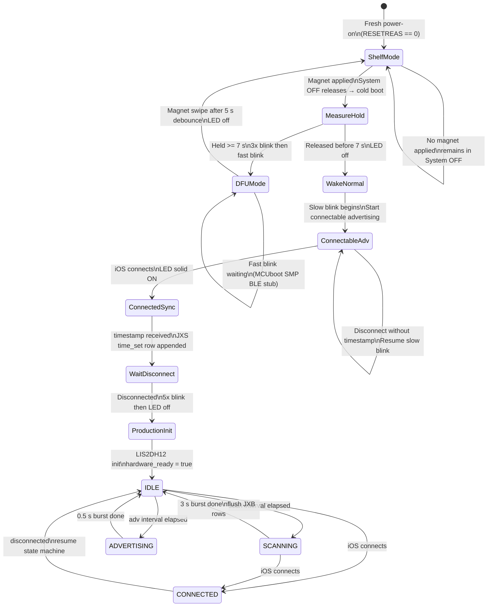

# juxta5-8-prod

Production Hublink firmware for Juxta5-8 (nRF52840). Combines Hublink GATT BLE, append-only NOR CSV logging, and LIS2DH12 motion/temperature sensing. Settings persist in nRF52840 internal flash.

---

## Boot and State Machine

### Boot path

```
Power-on / Reset
      │
      ├─ RESETREAS == 0 (fresh power-on)
      │         └─→ Shelf mode (System OFF, MAG_INT wake). No LED.
      │
      ├─ RESETREAS[OFF] set (woke from System OFF via magnet)
      │         └─→ LED ON while magnet held → measure hold duration
      │                   ├─ < 7 s  → LED off → slow blink → Datetime sync phase
      │                   └─ ≥ 7 s  → 3× blink → fast blink → DFU mode (stub)
      │
      └─ Other (watchdog, pin reset, lockup)
                └─→ Skip shelf/hold, go straight to production init. No LED gate.
```

### Datetime sync phase (normal wake only)

```
Slow blink (50 ms ON / 450 ms OFF) — waiting for iOS connection
      │
      └─ iOS connects
               │  LED: solid ON
               ├─ timestamp received via Gateway
               │         └─ wait for disconnect
               │                   └─ 5× blink → LED off → Production init
               │
               └─ disconnect without timestamp
                         └─ slow blink → restart connectable advertising
                                         (loops indefinitely until timestamp received)
```

### Production state machine

```
IDLE
 ├─ scan interval elapsed  → SCANNING (3 s passive burst) → flush JXB rows → IDLE
 ├─ adv interval elapsed   → ADVERTISING (0.5 s non-conn) → IDLE
 └─ iOS connects           → CONNECTED (radio owned by BT stack)
                                     └─ disconnect → IDLE

(JXGA_ overheard in scan → 30 s connectable “gateway” adv: **disabled** in default build;
re-enable with `-DJUXTA_PROD_ENABLE_JXGA_GATEWAY_ADV=1` or define the macro to 1 in `main.c`.)

Parallel vitals timer (every vitals_interval_s):
  LIS2DH12 temp + SAADC batt_mv + motion count → append JXV row
```

### Scanning vs advertising (operational BLE)

After **production init** (`hardware_ready`), the device never runs **non-connectable advertising** and **passive scanning** at the same time. **Opportunistic connectable advertising** after overhearing a **`JXGA_`** name is **disabled** by default (`JUXTA_PROD_ENABLE_JXGA_GATEWAY_ADV` = 0 unless overridden at compile time; default in [`src/main.c`](src/main.c)). A **`k_timer`** (`state_timer`) wakes a **`k_work`** handler (`state_work_handler`) on a schedule; each invocation **tears down** whatever phase was active (stop adv and/or stop scan), returns to an internal **IDLE** bookkeeping state, then optionally starts **one** new phase.

**Phases (mutually exclusive on the radio during normal operation)**

| Phase | What starts | How long (`state_timer`) | Purpose |
|--------|-------------|---------------------------|---------|
| **Non-connectable advertising** | `start_nonconn_adv()` — fast interval, name in AD only | `ADV_BURST_MS` (**500 ms**) | Broadcast `JX_…` identity so other Juxta units can see us |
| **Passive scanning** | `start_scanning()` — stops any adv first, 100 ms gap, then `bt_le_scan_start` | `SCAN_BURST_MS` (**3000 ms**) | Listen for peer `JX_…` names; queue events for **JXB** logging after the burst |
| **Connectable “gateway” advertising** (optional) | `start_connectable_adv()` (Hublink, full GATT) | `GATEWAY_ADV_MS` (**30 s**) | When `JUXTA_PROD_ENABLE_JXGA_GATEWAY_ADV` is **1**: after a **`JXGA_`** name is overheard in scan, open a connectable window for an iOS gateway. **Default build: disabled.** |

**When both “due”, scan wins.** After going IDLE, the handler evaluates **`scan_due`** (`juxta_time_now()` ≥ `last_scan_ts` + **`scan_interval_s`** from NVS / Gateway), then **`adv_due`** (≥ `last_adv_ts` + **`ADV_INTERVAL_S`**, fixed **10 s** in firmware). If `JUXTA_PROD_ENABLE_JXGA_GATEWAY_ADV` is enabled, **`do_gateway_adv`** (set when a scanned name begins with **`JXGA_`**) is evaluated **before** `scan_due` / `adv_due`. If nothing applies, it programs the timer for the **earlier** of the next scan vs adv deadline, plus a small **random jitter** (0–999 ms) to desynchronize colliding devices.

**Timing note:** `scan_due` / `adv_due` are driven by **`juxta_time_now()` in whole seconds**, so **`ADV_BURST_MS` (500) and `SCAN_BURST_MS` (3000) are not a harmful “divisor” relationship** for the state machine—bursts are sequential one-shots. **Idle-period jitter** (0–999 ms on the next sleep) is what spreads out **peer** wakeups when many devices use similar `scan_interval_s` / `ADV_INTERVAL_S`; it does not randomize burst lengths. Repeated **ties** on the same second are more likely when `scan_interval_s` is a multiple of **10** (same as `ADV_INTERVAL_S`) than from 3000 being 6×500.

**While an iOS client is connected** (`ble_connected`), the work handler **returns immediately** — the stack owns the connection; scan/adv cycling resumes from **IDLE** after disconnect (see `on_disconnected` in the same file).

**Magnet shelf path:** if the user holds the magnet (not connected), firmware stops adv and scan, forces **IDLE**, then enters shelf after the debounce sequence — same “radio off before shelf” idea.

---

## State Machine Diagram



---

## Magnet Gesture Reference

| Gesture | LED feedback | Effect |
|---|---|---|
| Apply at any time (device in shelf mode) | LED ON immediately | Wakes device from System OFF → cold boot |
| Release < 7 s after cold boot | LED off → slow blink (50/450 ms) | Gateway advertising mode; waits for datetime sync |
| Hold ≥ 7 s after cold boot | 3× blink → fast blink (50/50 ms) | DFU mode; 5 s debounce then magnet swipe returns to shelf |
| Any connect event | Solid ON | Active BLE connection |
| Disconnect after valid timestamp | 5× blink → LED off | Production init begins |
| Disconnect without timestamp | Slow blink resumes | Restarts connectable advertising |
| Magnet swipe during DFU fast-blink | LED off | Returns device to shelf mode |
| Magnet held during production (not connected) | 5× blink → LED off | 5 s debounce then shelf mode |

LED0 (P0.09, `CONFIG_NFCT_PINS_AS_GPIOS=y`) is used for all sequences.

---

## Hublink Gateway Data Exchange

All BLE communication uses the **Hublink service** (`57617368-5501-0001-8000-00805f9b34fb`).

### Characteristics

| Characteristic | UUID suffix | Permissions | Description |
|---|---|---|---|
| Node | `...5505` | READ | JSON device status; read once after connect |
| Gateway | `...5504` | WRITE / WRITE NO RSP | JSON command from iOS to device |
| Filename | `...5502` | READ / WRITE / INDICATE | File listing and file selection |
| File Transfer | `...5503` | READ / INDICATE / CCC | Chunked file payload |

---

### Node characteristic (READ → iOS)

Single JSON object. iOS reads this once on connect.

```json
{
  "upload_path": "/",
  "firmware_version": "5.8.0",
  "battery_level": 87,
  "device_id": "JX_9B10A1",
  "alert": "",
  "product": "Juxta5-8",
  "log_schema": "jxta-nor-csv-v4",
  "logging_version": 4,
  "experiment": "",
  "subject_id": "JX_9B10A1"
}
```

| Field | Type | Description |
|---|---|---|
| `upload_path` | string | Always **`/`** (hard-coded in firmware; not NVS-configurable) |
| `firmware_version` | string | Semantic version; `5.8.x` signals NOR CSV decoder |
| `battery_level` | integer 0–100 | Percent, derived from SAADC voltage (3.0 V = 0 %, 4.2 V = 100 %) |
| `device_id` | string | Stable hardware ID `JX_XXXXXX` (last 3 MAC bytes); never changes |
| `alert` | string | Reserved for future device alerts; currently always `""` |
| `product` | string | `"Juxta5-8"` — tells iOS to use the NOR CSV decoder |
| `log_schema` | string | `"jxta-nor-csv-v4"` — identifies the log format version |
| `logging_version` | integer | `4` — integer decoder selector |
| `experiment` | string | Current experiment string from NVS settings (empty until set via Gateway) |
| `subject_id` | string | Current subject assignment from NVS (same value Gateway may set as `subjectId`) |

---

### Gateway characteristic (WRITE → device)

JSON object; any subset of keys may be sent. Unrecognized keys are silently ignored. **`uploadPath`** is not applied (Node `upload_path` is fixed to **`/`**).

```json
{
  "timestamp": 1746000000,
  "sendFilenames": true,
  "clearMemory": true,
  "scanInterval": 30,
  "vitalsInterval": 60,
  "subjectId": "mouse_07",
  "experiment": "social_v1"
}
```

| Field | Type | Effect |
|---|---|---|
| `timestamp` | uint32 Unix seconds | Sets device clock; appends `time_set` row to JXS |
| `sendFilenames` | bool | Triggers file listing indication on Filename characteristic |
| `clearMemory` | bool | Erases all NOR CSV regions; creates fresh daily files; appends `memory_cleared` to JXS; **does not clear NVS settings** |
| `reset` | bool | Immediately enters shelf mode (System OFF in production; soft reboot in debug) |
| `scanInterval` | integer (seconds) | BLE scan interval; stored in NVS; appends `settings_changed` to JXS |
| `vitalsInterval` | integer (seconds) | Vitals logging interval; stored in NVS; appends `settings_changed` to JXS |
| `subjectId` | string | Subject assignment; stored in NVS; appends `settings_changed` to JXS |
| `experiment` | string | Experiment grouping string; stored in NVS; appends `settings_changed` to JXS |

---

### File listing (Filename characteristic)

Triggered by `"sendFilenames": true` in a Gateway write, or by writing `"LIST"` to the Filename characteristic directly. The device sends an **indication** with a semicolon-separated list:

```
JXS20260507.csv|2048;JXV20260507.csv|14592;JXB20260507.csv|30720
```

Each entry is `filename|size_in_bytes`. **Size** is the **CSV payload** byte count on File Transfer (no leading filename line, no NOR `#EOF` line in that count). A separate **standalone** File Transfer indication with payload **`EOF`** (3 ASCII bytes) follows all data indications and is **not** included in **size**.

---

### File transfer protocol (File Transfer characteristic)

1. iOS writes the desired filename to the **Filename** characteristic (e.g. `JXV20260507.csv`).
2. The device streams the file as a sequence of **indications** on the **File Transfer** characteristic.
   - Data payloads are **CSV only**: the first line stored on NOR (`filename.csv`) is skipped; indications start at the CSV header row. The NOR `#EOF` line is **not** sent as file bytes.
   - Each data indication payload is up to `min(MTU − 3, 512)` bytes (last chunk may be short).
   - The device waits for each indication confirmation before sending the next chunk.
3. After all data chunks, the peripheral sends **one** final indication on File Transfer whose value is exactly the string **`EOF`** (three bytes — gateway end-of-transfer marker). This is distinct from the Filename listing terminator `EOF` and from the `#EOF` line stored on NOR when a file closes.
4. iOS should request MTU exchange to 247 bytes for optimal throughput (~244 bytes per data indication).

---

## NOR Flash Layout

| Region | Address | Size | Content |
|---|---|---|---|
| JXS | `0x000000 – 0x00FFFF` | 64 KB | Settings / events log |
| JXV | `0x010000 – 0x10FFFF` | 1 MB | Vitals log |
| JXB | `0x110000 – 0x3FFFFF` | 3 MB | BLE observations log |

All regions are append-only CSV. Each pseudo-file is physically stored as:

```
JXVYYYYMMDD.csv
unix,motion,batt_v,temp_c
1715200000,12,3.81,24
#EOF
```

Settings and the log-state cache live in nRF52840 internal flash (`storage_partition` at `0xF0000`, 64 KB) via Zephyr NVS.

---

## File Structure

```
applications/juxta5-8-prod/
├── CMakeLists.txt
├── prj.conf
├── sample.yaml
├── README.md            ← this file
└── src/
    ├── main.c           ← boot sequence, magnet hold, shelf mode, state machine
    ├── ble_service.c/h  ← Hublink GATT (Node/Gateway/Filename/FileTransfer)
    ├── juxta_log.c/h    ← NOR CSV append, list, read, recover
    ├── juxta_settings.c/h ← NVS-backed current settings + log-state cache
    ├── juxta_time.c/h   ← Unix timestamp set/get, date string formatter
    └── juxta_prod.h     ← shared constants (version, sizes, defaults)
```

---

## Implementation Status and Remaining Work

### Implemented

| Feature | Notes |
|---|---|
| Shelf mode (System OFF) | Fresh boot → `sys_poweroff()`, MAG_INT `GPIO_INT_LEVEL_LOW` wake source |
| Magnet hold measurement | < 7 s → normal wake, ≥ 7 s → DFU path |
| LED mode state machine | `OFF`, `ON` (connected), `SLOW_BLINK` (50/450 ms, gateway adv), `FAST_BLINK` (50/50 ms, DFU) driven by kernel timer + work item |
| LED blink sequences | Magnet hold: solid ON; DFU entry: 3× 200 ms blink; production init: 5× 50 ms blink |
| Datetime sync gate | Connectable adv after normal wake; loops indefinitely until timestamp received; must have timestamp before production init |
| Watchdog | 30 s window, fed every 10 s, pauses on debug halt |
| NVS settings | `subject_id`, `experiment`, `scan_interval_s`, `vitals_interval_s` (plus `upload_path` slot always written as **`/`**; reserved bytes for legacy blob layout) |
| NOR CSV logging | JXS events, JXV vitals, JXB BLE observations; append-only, `#EOF` on close |
| Log-state cache | MCU NVS caches file offsets; scans NOR on cache miss |
| BLE state machine | Non-conn advertising bursts (10 s interval), passive scan bursts (configurable); JXGA_ opportunistic connectable adv **disabled** in source (`JUXTA_PROD_ENABLE_JXGA_GATEWAY_ADV`) |
| Battery level in Node JSON | SAADC mV sampled on connect and each vitals tick; calibrated factor 7.96×; linear 3.0–4.2 V → 0–100 % |
| Battery safeguards | Brownout < 2.9 V → shelf mode (boot + vitals timer, logs `low_battery`); DFU gate < 3.2 V → falls back to normal wake |
| Hublink GATT service | Node, Gateway, Filename, File Transfer characteristics; UUIDs match iOS companion |
| Node JSON | Legacy keys + `product`, `log_schema`, `logging_version`, `experiment` (5.8 fields) |
| Gateway commands | `timestamp`, `sendFilenames`, `clearMemory`, `reset`, `scanInterval`, `vitalsInterval`, `subjectId`, `experiment` |
| BLE connection optimisation | MTU exchange initiated on connect; supervision timeout 4 s; preferred interval 30–50 ms via `bt_conn_le_param_update` |
| Production magnet-to-shelf | Magnet held in production (not connected) → 5× blink → 5 s debounce → shelf mode |
| Debugger simulation loop | `CoreDebug->DHCSR` detects J-Link; simulates shelf/wake/DFU cycle in-band; `sys_reboot()` restarts loop |
| Vitals logging | LIS2DH12 temperature, SAADC battery voltage, motion count → JXV |
| BLE observation logging | `JX_XXXXXX` peer detection → JXB rows with observer/peer/rssi |
| JXS provenance rows | `boot`, `time_set`, `settings_changed`, `user_connected`, `user_disconnected`, `memory_cleared`, `low_battery` |
| File listing wire format | `name\|size;name\|size;EOF` — matches legacy juxta-ble iOS parser |
| FUEL pin correction | FUEL on P0.30/AIN6 (was incorrectly mapped to P0.28/AIN4 = AXY_INT2) |

### Pending / Not Yet Implemented

| Feature | Notes |
|---|---|
| **JXGA_ opportunistic gateway adv** | Post–ProductionInit connectable advertising after overhearing `JXGA_*` in scan is **compiled out** (`JUXTA_PROD_ENABLE_JXGA_GATEWAY_ADV` = 0). Re-enable with `-DJUXTA_PROD_ENABLE_JXGA_GATEWAY_ADV=1` or by defining the macro to **1** before the `#ifndef` in `main.c`. |
| **DFU mode** | `enter_dfu_mode()` is a halting stub. Requires MCUboot SMP BLE stack (`CONFIG_MCUMGR`, `CONFIG_IMG_MANAGER`, SMP Bluetooth transport). DFU advertising name and behavior to be defined. |
| **Advertising interval setting** | `advInterval` gateway key is logged but not applied; advertising uses `ADV_INTERVAL_S = 10` build constant. |
| **Daily file rotation** | New date-named files are created when `juxta_time_now()` crosses midnight. Requires the clock to be valid; files accumulate until `clearMemory`. |
| **iOS companion decoder** | iOS app needs a branch path for `log_schema: jxta-nor-csv-v4` (JXS without `mode` column) to parse JXS/JXV/JXB CSV files instead of legacy FRAMFS binary blobs. |
| **Hardware validation** | Full boot/magnet/datetime/scan/vitals/transfer sequence tested on hardware; extended field deployment pending. |
